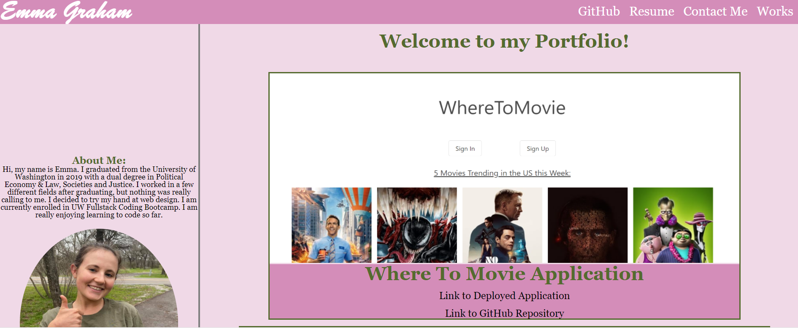
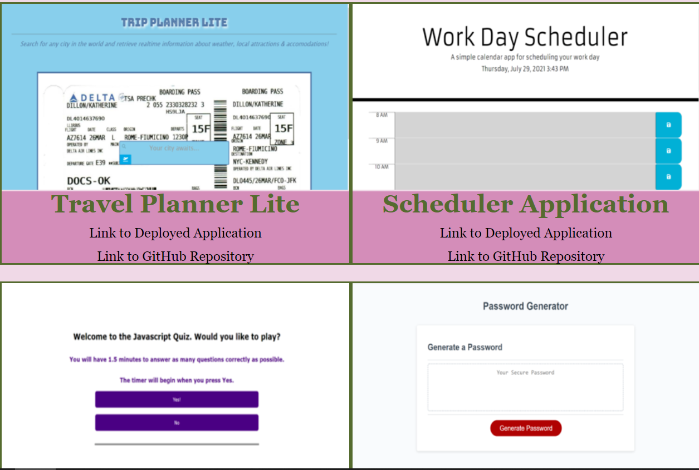

# Homework Assignment 8 - Professional Materials

## Your Task:
This assignment required us to revisit the Portfolio we made in Homework Assignment #2 (https://egraham96.github.io/homework-assignment-02/). In Homework Assignment #2, we were asked to built a Portfolio that would showcase our completed applications. At the time, our website had to be responsive to different screen sizes, had to include working links & pseudoclasses such as hover and working images. Since completing Homework Assignment #2, I have learned Javascript, jQuery, jQuery UI, Bootstrap, Node.JS, and Web APIS--these new languages are reflected in the 4 projects I added to the Portfolio. I also added screenshots & links to the 4 new projects. I added my Resume and links to my GitHub & LinkedIn profile. I updated the styling of the page. I made the ReadMe for this Portfolio more comprehensive. 

## Built With:
* HTML
* CSS

## Deployed Links:
* [See Live Site](https://egraham96.github.io/homework-assignment-08/)
* [Link to GitHub Repo](https://github.com/egraham96/homework-assignment-08)

## Preview of Working Site:

## Contact the Creator:
* Emma Graham: https://github.com/egraham96

## License:
Copyright (c) <2021><Emma Graham>

Permission is hereby granted, free of charge, to any person obtaining a copy
of this software and associated documentation files (the "Software"), to deal
in the Software without restriction, including without limitation the rights
to use, copy, modify, merge, publish, distribute, sublicense, and/or sell
copies of the Software, and to permit persons to whom the Software is
furnished to do so, subject to the following conditions:

The above copyright notice and this permission notice shall be included in all
copies or substantial portions of the Software.

THE SOFTWARE IS PROVIDED "AS IS", WITHOUT WARRANTY OF ANY KIND, EXPRESS OR
IMPLIED, INCLUDING BUT NOT LIMITED TO THE WARRANTIES OF MERCHANTABILITY,
FITNESS FOR A PARTICULAR PURPOSE AND NONINFRINGEMENT. IN NO EVENT SHALL THE
AUTHORS OR COPYRIGHT HOLDERS BE LIABLE FOR ANY CLAIM, DAMAGES OR OTHER
LIABILITY, WHETHER IN AN ACTION OF CONTRACT, TORT OR OTHERWISE, ARISING FROM,
OUT OF OR IN CONNECTION WITH THE SOFTWARE OR THE USE OR OTHER DEALINGS IN THE
SOFTWARE.

